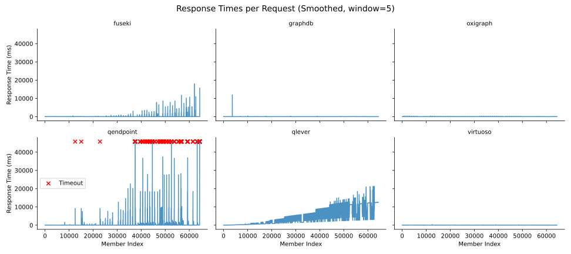

# ldes2sparql

[RDF-Connect](https://rdf-connect.github.io/) pipeline for materializing [Linked Data Event Streams (LDES)](https://w3id.org/ldes/specification) into a target SPARQL graph store.

Internally, it uses the Typescript [ldes-client](https://github.com/rdf-connect/ldes-client) and the also Typescript [sparql-ingest-processor](https://github.com/rdf-connect/sparql-ingest-processor-ts).  

## Run with docker

Pull the docker image:
```bash
docker pull ghcr.io/rdf-connect/ldes2sparql:latest
```

Run a container instance with the following command:

```bash
docker run \
-e "LDES=http://your.ldes.address" \
-e "SPARQL_ENDPOINT=http://your.sparql.server/update" \
-e "TARGET_GRAPH=https://www.marineregions.org/graph" (optional)\
-e "ORDER=[ascending|descending]" (optional)\
-e "FOLLOW=[true|false]" (optional)\
-e "POLLING_FREQUENCY=5000" (optional)\
-e "MATERIALIZE=[true|false]" (optional)\
-e "LAST_VERSION_ONLY=[true|false]" (optional)\
-e "AFTER=2024-12-31T23:59:59.999Z" (optional)\
-e "BEFORE=2026-01-01T00:00:00.000Z" (optional)\
-e "SHAPE=https://my.dereferenceable.shape" (optional)\
-e "OPERATION_MODE=[Sync|Replication]" (optional)\
-e "MEMBER_BATCH_SIZE=500" (optional)\
-e "FOR_VIRTUOSO=true" (optional)\
-e "ACCESS_TOKEN=marine-regions_1234" (optional)\
-e "PERF_NAME=virtuoso" (optional) \
-e "FAILURE_IS_FATAL[true|false]" (optional) \
-e "QUERY_TIMEOUT=30" (optional) \
-e "START_FRESH=[true|false]" (optional) \
-v /your/state/folder:/state \
-v /your/benchmark/folder:/performance \
ghcr.io/rdf-connect/ldes2sparql:latest
```

The container can also be run using an environment [config file](https://github.com/rdf-connect/ldes2sparql/blob/main/conf.env) as follows:

```bash
docker run --env-file conf.env -v /your/state/folder:/state ghcr.io/rdf-connect/ldes2sparql:latest
```

## Parameters

A description of all available environment variables is presented next:

| Variable Name | Mandatory or Optional | Value Type | Example Value | Description |
| :--- | :--- | :--- | :--- | :--- |
| `LDES` | Mandatory | URL | `http://marineregions.org/feed` | The URL of the LDES to be replicated and followed. |
| `SPARQL_ENDPOINT` | Mandatory | URL | `http://localhost:8890/sparql` | The URL of the target SPARQL graph store, which must support the [SPARQL UPDATE specification](https://www.w3.org/TR/sparql11-update/). |
| `OPERATION_MODE` | Mandatory | `Replication`, `Sync` | `Sync` | Defines the operation mode of the pipeline. `Replication` mode relies on the [SPARQL Graph Store Protocol](https://www.w3.org/TR/sparql11-http-rdf-update/) to ingest data directly into a triple store (normally faster than using SPARQL UPDATE queries), which assumes that all received data is meant to be added (Updates or Deletes are not supported). `Sync` mode uses the [SPARQL UPDATE specification](https://www.w3.org/TR/sparql11-update/) to ingest data via SPARQL queries, allowing for all Create/Update/Delete operations. |
| `MEMBER_BATCH_SIZE` | Mandatory | Number | `500` | The number of members to be processed in each batch. |
| `TARGET_GRAPH` | Optional | IRI | `https://example.org/graph` | An IRI of a targeted named graph where all replicated triples will be written. If not required, define it with an empty value (`TARGET_GRAPH=`), otherwise invalid queries will be produced. |
| `ORDER` | Optional | `ascending`, `descending` | `descending` | An instruction for the LDES client to emit members in `ascending` or `descending` temporal order (based on the `ldes:timestampPath` property value). |
| `FOLLOW` | Optional | `true`, `false` | `false` | A property that indicates whether the LDES client should continue to poll the LDES for new events after the replication has been completed. The default value is `false`. |
| `POLLING_FREQUENCY` | Optional | Number | `5000` | A property that instructs the client to poll the LDES following the given frequency to check for new events after replication. It is given in milliseconds and it is ignored if `FOLLOW` is set to `false`. |
| `MATERIALIZE` | Optional | `true`, `false` | `false` | Property that instructs the LDES client to materialize replicated members (i.e., to use the declared `ldes:versionOfPath` property value as the member subject). The default value is `false`. |
| `LAST_VERSION_ONLY` | Optional | `true`, `false` | `false` | Property that instructs the client to only emit the latest versions of every member. If enabled, it enforces the LDES client to emit members in an `descending` temporal order. The default value is `false`. |
| `AFTER` | Optional | Datetime | `2025-01-01T00:00:00.000Z` | Datetime property that instructs the client to only emit memebers timestamped after (exclusive) the given datetime. |
| `BEFORE` | Optional | Datetime | `2026-01-01T00:00:00.000Z` | Datetime property that instructs the client to only emit memebers timestamped before (exclusive) the given datetime. |
| `SHAPE` | Optional* | URL | `https://example.org/shape` | URL of a SHACL shape that the LDES client will use to guide the [member extraction process](https://github.com/TREEcg/extract-cbd-shape) to, for example, emit members with property subsets or include out-of-band (i.e., externally linked) property values. Alternatively, a local shape file may be used, but this requires the Docker image of `ldes2sparql` to be rebuilt including such shape file. |
| `CONCURRENT_FETCHES` | Optional | Number | `10` | Maximum number of concurrent HTTP requests that the LDES client may perform while replicating the LDES. For some LDES, this needs to be limited to avoid, for example, `HTTP 429 Too many requests` responses. |
| `START_FRESH` | Optional | `true`, `false` | `false` | Property that instructs the LDES client to start with a fresh state. It will delete any pre-existing state present in the given state path (e.g., via `-v /your/state/folder:/state`). |
| `FOR_VIRTUOSO` | Optional | `true`, `false` | `false` | Property to indicate that the target SPARQL graph store is a Virtuso instance, which then splits large INSERT DATA queries, to avoid Virtuoso's hard limits such as the [max SQL query length](https://github.com/openlink/virtuoso-opensource/blob/develop/7/libsrc/Wi/sparql2sql.h#L1031) and the [max query vector size](https://community.openlinksw.com/t/virtuosoexception-sq199/1950). |
| `ACCESS_TOKEN` | Optional | String | `my_token` | Security property that is required to [enable SPARQL UPDATE queries in Qlever](https://github.com/ad-freiburg/qlever/blob/41864b6cc95e167e098ee7466af37ccc8a925723/src/engine/Server.cpp#L497). |
| `PERF_NAME` | Optional | String | `perf_file` | Name of the file that will be use to record the individual request times for benchmarking purposes. |
| `FAILURE_IS_FATAL` | Optional | `true`, `false` | `true` | Indicates whether the pipeline execution is fully stopped when a query does not succeed. |
| `QUERY_TIMEOUT` | Optional | Number | `1800` | Maximum time in seconds that is allowed for a query to be resolved. If the time is exceeded, an error will be thrown. If not specified, a default timeout of 30 mins will be set. |
> *This parameter is optional but must be present to avoid crashing the LDES client. **Leave it empty if not required**. A proper solution to this issue is in the works.

## Benchmarks 

> **Note:** The following results were obtained using [this version of `ldes2sparql`](https://github.com/MareGraph-EU/ldes2sparql/commit/d83a31911237176edefedc2b8f49b0522e2629ea)

We run some benchmarks using `ldes2sparql` to fully replicate the [Marine Regions (mirror) LDES](http://193.190.127.143:8080/marine-regions-mirror/ldes) into different open source SPARQL graph stores.

We measured the time that took `ldes2sparql` to fully replicate the LDES into the target SPARQL store and also the individual request times, having a `timeout of 30 seconds` per request. The benchmarks were run using Dockerized components (i.e., every graph store and the ldes2sparql pipeline run in their own Docker containers) in a server having: 
- `1x6 core Intel Core i5-9500 CPU (3.00GHz)`
- `64GB of RAM` (with 60GB allocated to the SPARQL engines) 
- `512GB Western Digital TM PC SN810 NVMeTM SSD`

For reproducibility we set datetime constraints to the LDES replication process, instructing the LDES client to replicate all members before `2025-08-14T00:00:00.000Z`, which results in a total of `64369 members`, that are then materialized (i.e., we end up with the latest version of every member) into a knowledge graph having `749862 triples` in total. We don't set a target named graph for the ingestion queries, mainly because [qEndpoint does not support named graphs in its docker version](https://github.com/the-qa-company/qEndpoint/issues/616), with the exception of Virtuoso for which is mandatory to set a target named graph. The benchmarks were executed using the [`hyperfine`](https://github.com/sharkdp/hyperfine) tool with the [script available in this repository](https://github.com/rdf-connect/ldes2sparql/blob/main/benchmark/benchmark.sh).

**Table 1.** Total execution time for a full LDES replication.
| SPARQL engine | Total time [s] | Timeouts |
|:---|---:|---:|
| Apache Jena Fuseki | 5653.153 | 0 |
| GraphDB | 1080.582 | 0 |
| Oxigraph | 355.631 | 0 |
| qEndpoint | 17039.606 | 264 |
| Qlever | 302825.197 | 0 |
| Virtuoso | **334.591** | 0 |

In Table 1 we see the results of our benchmark, where `Virtuoso` registers the fastest overall ingestion time with a total of 334.591s. `Oxigraph` comes at a close second place, followed by `GraphDB`, `Fuseki`, `qEndpoint` and `Qlever`. `qEndpoint` is the only graph store that produced request timeouts with 264 and a total time of 17039.606s, and although it didn't have timeouts, `Qlever` total ingestion time was by far the longest with 302825.197s (around three and a half days).


**Figure 1.** Update query response time distribution.

In Figure 1 we can observe the distribution of response times of every update SPARQL query, executed to ingest each of the LDES members. The blue `x` indicates the mean response time. `Virtuoso` and `Oxigraph` remain consistent throughout the ingestion process, where the other engines show a degradation of response times for multiple queries. 


**Figure 2.** Individual query response times.

Figure 2 shows how the ingestion process behaves over time for every graph store. We see how for both `Virtuoso` and `Oxigraph`, the query response time remains stable throuhgout the whole ingestion. `GraphDB` remains mostly stable as well, with the exception of a few high peaks (only 1 visible in the plot due to the smoothening) that increase the overall mean response time. `Fuseki` shows a degradation of query performance as time progresses and more data is ingested. For `qEndpoint` we observe a highly unstable process over time, that include the observed timeouts, making it unreliable. Lastly, for `Qlever` we can also observe a more pronounced linear degradation of query response as more data gets ingested.

Overall `Virtuoso` and `Oxigraph` showed the best performance to replicate a relatively small LDES, and in general to handle fast and small data updates via standard SPARQL UPDATE queries. `GraphDB` was almost 3 times slower overall, yet it still displayed a performance level that may be acceptable in some cases, which added to their various UI tools, could make it an attractive option. `Fuseki` was 17 times slower overall and also showed a linear degradation in query performance that suggests that it won't be feasible to be used with larger datasets. Lastly, `qEndpoint` and `Qlever` showed to be unreliable (timeouts in `qEndpoint`) and highly inneficient for this particular scenario. In `Qlever`'s defense, it is mentioned in their wiki that [SPARQL UPDATES are still experimental](https://github.com/ad-freiburg/qlever/wiki/First-tests-with-SPARQL-1.1-Update#tldr) and that future work will make them more efficient.   